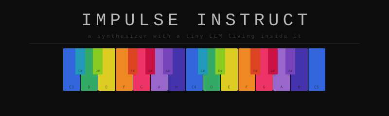

<p align="center">
  
</p>

# Impulse Instruct

A synthesizer with a tiny LLM living inside of it. **PULSE** runs locally and has full control of the sound — it listens to what you say, jams autonomously, and responds to the music in real time. You keep the parameters you want; it owns everything else.

> **Requires an NVIDIA GPU (CUDA) for real inference.** The app runs in mock mode without a model — the synth, sequencer, MIDI, and API all work, but responses are keyword-based rather than generated.

---

## Download

Pre-built binaries are available on the releases page:

- `impulse-instruct-linux-x86_64` — Linux (Ubuntu 22.04+)
- `impulse-instruct-windows-x86_64.exe` — Windows 10/11

**No installation required.** Download, make executable (Linux: `chmod +x`), and run.

---

## Getting started

### 1 — Download a model

The app ships without a model. Download one before first run:

```bash
./scripts/download-models.sh          # Gemma 4 E4B (~4.6 GB, recommended)
./scripts/download-models.sh bonsai   # Bonsai 8B (~1.1 GB, lightweight fallback)
```

A free [HuggingFace](https://huggingface.co/join) account is required. The script handles authentication and places the file in `models/`.

On **Windows**, run the equivalent `.bat` script:
```
scripts\download-models.bat
scripts\download-models.bat bonsai
```

### 2 — Run

```bash
./impulse-instruct-linux-x86_64
```

The app auto-detects the model in `models/` and connects to it. The model selector in **Prefs** lets you switch at runtime — no restart needed.

**No GPU?** Launch without a model and the app runs in mock mode. Responses are keyword-based presets rather than generated, but the full synth, sequencer, MIDI, and FX chain all work normally.

---

## Models

| Model | Size | VRAM | Notes |
|-------|------|------|-------|
| **Gemma 4 E4B Q4_K_M** | ~4.6 GB | ~6 GB | **Recommended.** Best JSON accuracy, passes all integration tests. Requires the standard llama-server (bundled). |
| **Bonsai 8B Q1_0_g128** | ~1.1 GB | ~2 GB | Lightweight fallback. Fits in 2 GB VRAM. Requires the PrismML llama-server fork (bundled separately). Lower musical accuracy. |

Switch models at any time via the model selector in **Prefs → Model**. The app restarts the inference server automatically.

---

## What it does

**Bass synthesizer**
- Saw / Square / Supersaw (detuned unison) oscillator; sub-oscillator; white noise source; FM pair
- Moog-style 4-pole ladder filter — LP / HP / BP modes; filter key tracking
- Portamento / glide time; per-step accent and slide; waveshaper (pre-filter tanh saturation)
- Internal overdrive; TB-303 envelope with env mod + decay

**Hoover lead**
- Supersaw → aggressive highpass filter sweep, pitch LFO for the "wailing" character
- Named after the vacuum cleaner drone on Human Resource "Dominator" (1991)

**AN1X-style virtual analog voice** (Boards of Canada / warm VA aesthetic)
- Dual oscillator (Saw, Square/PWM, Triangle, Sine, Noise); OSC2 detune coarse + fine; hard sync; ring mod
- Filter ADSR + amplitude ADSR + pitch envelope; per-voice LFO × 2 with delay and fade-in
- Pitch drift — subtle random LFO for tape-instability character; glide (always or legato)
- Free EG — 8-step drawable envelope (drag bars), runs alongside LFOs

**Drum machines**
- Kit A — kick (808-style with pitch envelope), snare, hihat × 2, toms
- Kit B — kick, snare, hihat × 2, clap, rim (909-style)
- Up to 64-step sequencer; per-voice velocity lanes; swing; euclidean rhythm generator

**Standalone noise voice** — white / pink / brown; volume + color + filter cutoff; addressable for ambient drones, breath, texture layers

**FX chain** (all wireable via prompt)
- Reverb (Schroeder/Freeverb), delay, chorus/ensemble, phaser (4-stage all-pass)
- Waveshaper, ring modulator, 3-band EQ, bitcrush, tape saturation, master drive
- Master compressor/limiter

**LFO system** — 4 independent slots, each wireable to any parameter; BPM sync; phase resets on transport start

**MIDI**
- MIDI in — auto-connects to first USB keyboard; notes trigger bass synth and write into live record; CC knobs map to synth params
- MIDI clock out — 24 PPQN, syncs external hardware and DAWs

**Export** — WAV (32-bit float) and MP3 (via ffmpeg)

---

## Talking to PULSE

PULSE is the AI inside. It reads the full parameter schema, listens to what you type, and writes back structured JSON that gets applied to the synth in real time. Talk to it like a producer collaborator — it understands music terminology, genre references, mixing decisions, and routing commands.

### Heat — the jam intensity dial

The **HEAT** slider in the header (shown as a percentage) controls how aggressively PULSE mutates the sound on its own.

| Heat | What happens |
|------|-------------|
| **0%** | PULSE is parked. Jam loop stops. It only responds when you send an explicit prompt. |
| **~15–25%** | Subtle drift — nudges filters, levels, and rhythm details between prompts. Good for long sets. |
| **~30–40%** | Default sweet spot. Slow pattern evolution, filter sweeps, occasional step changes. |
| **~60–75%** | Active rearrangement — new patterns, instrument swaps, FX edits every few bars. |
| **100%** | Full chaos. PULSE rewrites everything it can reach, constantly. |

Heat maps to LLM temperature (`0.1` at 0% → `1.2` at 100%). Low heat → more deterministic, tightly focused responses. High heat → wider sampling, more surprising choices.

### Jam mode

Jam is always on. As soon as a cycle completes, PULSE generates the next mutation automatically — as long as heat is above 0%. To pause autonomous generation without losing your settings, drag heat to 0. To stop narration while still jamming, change the conversation mode to **Off** in settings.

You can talk over the jam at any time. Your typed prompt takes priority and resets the cycle.

### The lock system

Touch any knob or slider and a small **U** indicator appears — that parameter is now **user-owned**. PULSE sees it as locked and will not overwrite it, even at full heat.

- **·** (dot) — Free — PULSE can touch this
- **U** — User-owned — yours; PULSE skips it
- **F** — LLM focus — PULSE prioritises this parameter

Right-click a knob to cycle modes manually, or let PULSE manage focus through prompts.

### Context and memory

PULSE keeps a rolling conversation history with the inference server. Every exchange — your prompts and its responses — is appended to the context window until it approaches the server's limit (~8 K tokens by default).

When the context reaches ~85% full, the app automatically restarts the server and clears the history (configurable via **auto-compact** in Prefs). PULSE starts fresh but carries the current synth state forward — it can see all the parameters as they are now, it just loses memory of past conversation turns.

The token counter in the header shows current context usage. If you notice PULSE becoming repetitive or drifting from earlier instructions, a manual **Reset context** in Prefs will clear the history and give it a clean slate.

---

## Prompt examples

Any parameter visible in the UI, PULSE can be asked to adjust. Any module in the rack, it can enable, configure, and wire up.

### Vibe and style

```
make it acid
dark techno, slow and hypnotic
go full jungle — fast breaks, heavy sub
BoC vibes — detuned, warm, melancholic
early 90s rave, hoover lead up front
make the bass more aggressive
softer — pull back the highs and add reverb
go minimal — strip everything back
```

### Rhythm and sequencer

```
sparse kick pattern, leave space
four-on-the-floor with an offbeat hihat
euclidean 5/16 on the kick
add a clap on beat 3
shuffle the hihat pattern
syncopate the bass, drop the root on beat 1
swing everything harder
```

### Sound design

```
more resonance, less decay on the filter
open up the cutoff slowly
make the bass supersaw with lots of unison
add FM to the bass — subtle, just for texture
distort the kick harder
pitch the 808 kick to the root note
make the snare crack more
```

### FX and routing

```
connect the bitcrush to the bass
wire up the reverb on the snare
add a short delay to the hihat — dotted eighth
turn up the phaser on the hoover
add tape saturation to the master
increase the reverb size, make it cavernous
add an LFO on the filter cutoff — slow sine, 0.5 depth
```

### Instruments and rack

```
add a hoover lead
bring in the AN1X — warm pad underneath
enable the noise voice for texture
activate the Amen sampler
add the bitcrush module
remove the chorus
```

### Production moves

```
raise the BPM to 140
transpose everything up a fifth
change the scale to Dorian
lock the BPM — don't touch it
evolve the melody but keep the kick pattern
save the project
```

### Settings and meta

```
talk less — just make the sounds
go into MC mode
stop narrating
heat yourself down a bit, things are too chaotic
turn the heat up — surprise me
```

---

## Farbige Noten — Color Theory

The piano display uses Ch. A. B. Huth's *Farbige Noten* (Hamburg 1888–1889), a 12-color system where each chromatic semitone maps counter-clockwise around the RYB color wheel starting from Blue at C.

| Note | Color |
|------|-------|
| C | Blue |
| C# | Cyan-Blue |
| D | Green/Teal |
| D# | Yellow-Green |
| E | Yellow |
| F | Orange |
| F# | Vermilion |
| G | Rose |
| G# | Carmine |
| A | Lilac-Violet |
| A# | Purple |
| B | Indigo |

Complementary colors (directly opposite on the wheel) correspond to tritone intervals — e.g. Blue C ↔ Orange F#. See `docs/colorful-notes.md` for the full theory.

---

## License

MIT — see LICENSE  
Gemma 4 model: [Google Gemma Terms of Use](https://ai.google.dev/gemma/terms)  
Bonsai 8B model: Apache 2.0 — credit to [prism-ml](https://huggingface.co/prism-ml)

---

---

## Further reading

| | |
|---|---|
| [docs/dev-setup.md](docs/dev-setup.md) | Build from source, architecture, HTTP API reference, parameter schema, Windows cross-compile |
| [docs/colorful-notes.md](docs/colorful-notes.md) | Full Huth *Farbige Noten* color theory — intervals, complementary pairs, historical context |
| [docs/ui-design.md](docs/ui-design.md) | UI design principles, grayscale palette, widget system |
