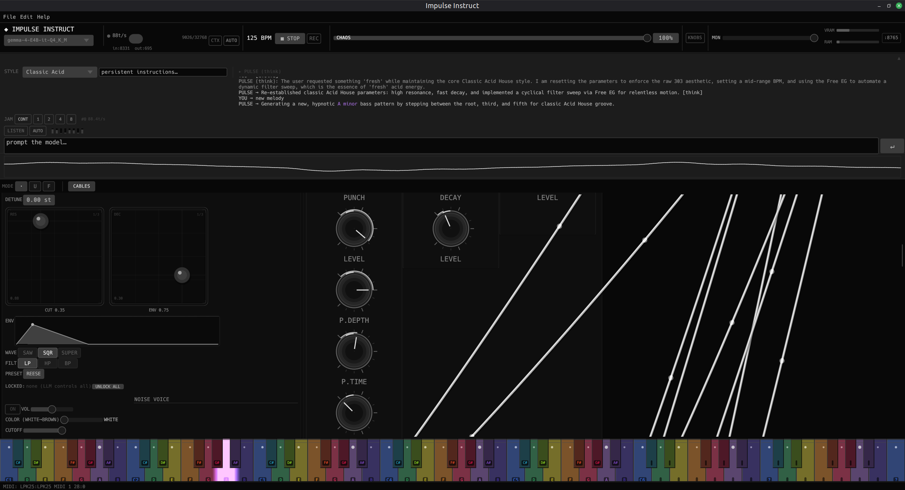

# Impulse Instruct

[](https://github.com/Tok/impulse-instruct/actions/workflows/ci.yml)
[](https://codecov.io/gh/Tok/impulse-instruct)

A **smart synthesizer** with a virtual production team living inside it. Multiple locally-running language models collaborate as AI agents — each with its own persona, scope, and model — to write patterns, shape sound, and evolve a track in real time. One agent handles bass, another drums, a third sculpts FX, and a conductor coordinates the session. Or run a single agent that controls everything. You decide the lineup.

You talk to them the way you'd talk to collaborators in the studio. Say "make it acid" and the bass agent adjusts the ladder filter, env mod, resonance, and note density. Say "dark techno, sparse, 132 BPM" and the agents restructure patterns and tighten FX routing to match. Say "keep the kick but change everything else" and the lock system protects what you've dialled in.

The agents run a continuous jam loop, evolving the sound between prompts at a rate you control with the **HEAT** slider. At low heat they nudge filters and rhythm details. At full heat they rewrite patterns, swap instruments, and restructure the FX chain constantly. Agents take turns in round-robin, each bringing its own creative perspective.

Everything runs entirely offline: no cloud calls, no subscriptions, no latency. Multiple LLM instances run locally via llama-server (one per model, ref-counted and shared across agents), the audio engine runs in a dedicated real-time thread, and they communicate through lock-free ring buffers. Nothing leaves your machine.

<p align="center">
  
</p>

> **Requires an NVIDIA GPU (CUDA).** A model must be downloaded before first run - see [Getting started](#getting-started).

---

## ⚠️ Alpha - Work in Progress (v0.5.9)

**This is pre-release software.** It works and makes sound, but expect rough edges. A few things worth knowing before you dive in:

- **Not ready for hyped live crowds.** The agents are agentic - they make their own creative decisions. That's delightful in the studio and potentially awkward in front of 300 people waiting for someone to shout "jungle selector massive!!".
- **Full heat means full rewrite.** The same prompt at the same heat will produce different results each run. That's the point - but the output is not deterministic.
- **The synthesis is more limited than the LLM's vocabulary.** The gap between what agents intend and what the synth engine produces is where most of the roughness lives - not in the model's musical understanding.
- **Windows build is untested.** The cross-compile produces a binary but it hasn't been run on real hardware yet. Linux is the only verified platform for this release.

See [Known Limitations](#known-limitations) for specifics on what works and what doesn't yet.

---

<p align="center">
  
</p>

---

## Download

Pre-built binaries are available on the releases page:

- `impulse-instruct-linux-x86_64` - Linux (Ubuntu 22.04+) - primary development platform, tested
- `impulse-instruct-windows-x86_64.exe` - Windows 10/11 - cross-compiled, **untested in this release**

**No installation required.** Download, make executable (Linux: `chmod +x`), and run.

---

## Getting started

### 1 - Download a model

The app ships without a model. Download one before first run:

```bash
./scripts/download-models.sh          # Gemma 4 E4B (~4.6 GB, recommended)
./scripts/download-models.sh bonsai   # Bonsai 8B (~1.1 GB, lightweight fallback)
```

A free [HuggingFace](https://huggingface.co/join) account is required. The script handles authentication and places the file in `models/`.

On **Windows**, run the equivalent `.bat` script:
```
scripts\download-models.bat
scripts\download-models.bat bonsai
```

### 2 - Run

```bash
./impulse-instruct-linux-x86_64
```

The app auto-detects the model in `models/` and connects to it. The model selector in **Prefs** lets you switch at runtime - no restart needed.

---

## Models

| Model | Size | VRAM | Notes |
|-------|------|------|-------|
| **Gemma 4 E4B Q4_K_M** | ~4.6 GB | ~6 GB | **Recommended.** Best JSON accuracy, passes all integration tests. |
| **Bonsai 8B Q1_0_g128** | ~1.1 GB | ~2 GB | Lightweight agent. Fits in 2 GB VRAM. Great for specialist agents in a multi-model team. |
| **DeepSeek-R1-Distill-Qwen-7B** | ~5 GB | ~7 GB | Chain-of-thought capable, Qwen2.5 base. |
| **DeepSeek-R1-Distill-Qwen-14B** | ~9 GB | ~11 GB | Higher quality CoT, needs 12+ GB VRAM. |

Each agent can run a different model. A `LlamaServerPool` manages server processes — agents sharing the same model share a single server (ref-counted). Typical multi-agent VRAM budgets:

| Setup | Agents | VRAM |
|-------|--------|------|
| **Solo** | 1x Gemma | ~6 GB |
| **Duo** | 2x Gemma (shared server) | ~6 GB |
| **Band** | 1x Gemma conductor + 4x Bonsai players | ~8 GB |
| **Swarm** | 1x Gemma + 3x Bonsai | ~8 GB |
| **Lite** | 1x Bonsai | ~2 GB |

A **startup wizard** on first launch detects your GPU, shows available VRAM, and suggests a configuration. Switch models per-agent at any time via the agent card dropdown.

---

## Features

**Synthesis**
- TB-303-style bass synth - saw/square/supersaw with detuned unison, 4-pole Moog ladder filter (LP/HP/BP), sub-oscillator, FM pair, waveshaper, overdrive, per-step accent and slide
- 808-style drum machine - kick with pitch envelope, snare, two hihats, toms
- 909-style drum machine - kick, snare, two hihats, clap, rim
- AN1X-style virtual analog voice - dual oscillator, hard sync, ring mod, two independent ADSRs, two per-voice LFOs, pitch envelope, free EG (8-step drawable envelope)
- Hoover lead synth - supersaw into aggressive highpass sweep
- Standalone noise voice - white/pink/brown with filter
- Amen break sampler voice - loop-playback with pitch control

**Sequencer**
- 16 to 64 steps per pattern, independently configurable per voice (polyrhythm)
- Per-step velocity, probability, ratchet (1-4x), accent, slide
- Euclidean rhythm generator; swing; time signature selector (4/4, 3/4, 5/4, 6/8, 7/8, ...)
- Pattern bank (8 slots); chain playback (up to 8 patterns in sequence)
- Live record from MIDI keyboard; mute/solo per voice; copy/paste

**FX and modulation**
- Reverb, delay (echo), chorus/ensemble, 4-stage phaser, ring modulator
- Waveshaper (pre-FX tanh saturation), bitcrush (bit depth + rate), 3-band EQ, tape saturation, master drive
- Master compressor/limiter
- Modular rack: drag-to-patch cable connections between voices and FX modules; right-click a port to disconnect; animated Bezier cables with signal flow dots; per-voice FX buses; topology compiled live
- 4-slot LFO matrix - any waveform, BPM-syncable, wireable to any parameter

**Intelligence — multi-agent production team**
- Multiple LLM agents, each with its own persona, model, scope, heat, temperature, and style
- Agents take turns in round-robin; each agent only controls the modules it's wired to via control cables
- Server pool: `LlamaServerPool` manages N llama-server processes, ref-counted per model — agents sharing a model share a single server
- Startup wizard: detects GPU VRAM, suggests configurations (Solo, Duo, Band, Swarm, Voices, Lite)
- Dynamic spawning: agents can request new agents or dismiss themselves via JSON actions
- Cable-driven scope: control cables from agent to module define what each agent can touch; removing a cable restricts scope
- Jam mode: continuous autonomous loop, rate and intensity controlled by HEAT slider (0-100%)
- Behaviour templates: "build", "drop", "breakdown", "tension", "euphoric"
- Lock system: touch any knob to claim it; agents will not overwrite user-owned parameters
- Scale and root note in system prompt; bass notes snapped to current scale
- Instruction set: pre-written JSON templates for common phrases ("make an amen break", etc.)
- Context-aware: rolling conversation history, auto-restart when approaching token limit
- Adjustable sampling params (temperature, top_k, top_p, min_p, repeat penalty, seed)
- Chain-of-thought reasoning visible in the log (toggle)
- LISTEN button: captures audio, runs per-band analysis, prepends snapshot to prompt

**TTS / MC mode**
- espeak-ng backend for low-latency MC lines
- Coqui TTS backend for higher quality synthesis
- Per-character pitch and speed variation; pitch-snap to current key/scale
- Voice characters: Jungle MC, Rave Announcer, Robot, Smooth DJ
- TTS routed through the rack FX chain (default: reverb); synth ducked under TTS

**I/O and integration**
- MIDI in: NoteOn/Off to bass synth and live record; CC to synth params; Start/Stop transport
- MIDI clock out: 24 PPQN via dedicated thread (alloc-free audio path)
- HTTP/MCP REST API on port 8765 (`--api` flag) - query state, send prompts, set params, lock/unlock, control transport
- OSC input: UDP listener, compatible with Max/MSP, TouchOSC, Ableton, oscsend
- WAV export (32-bit float) and MP3 export (via ffmpeg); stem export per voice
- Project save/load as JSON snapshots; undo/redo (50-deep history)

---

## What it does

**Acid bass synthesizer**
- Saw / Square / Supersaw oscillator with detuned unison; sub-oscillator; white noise; FM pair
- Moog-style 4-pole ladder filter - LP / HP / BP; filter key tracking
- Per-step accent and slide; portamento; waveshaper (pre-filter tanh saturation); internal overdrive
- TB-303 envelope: env mod, decay, gate

**Drum machines**
- Kit A - 808-style: kick with pitch envelope, snare, two hihats, toms
- Kit B - 909-style: kick, snare, two hihats, clap, rim
- Up to 64 steps per pattern; per-voice velocity lanes; swing; euclidean rhythm generator

**AN1X-style virtual analog voice**
- Dual oscillator (Saw, Square/PWM, Triangle, Sine, Noise); OSC2 detune coarse + fine; hard sync; ring mod
- Filter ADSR + amplitude ADSR + pitch envelope; two per-voice LFOs with delay and fade-in
- Pitch drift for tape-instability character; glide (always or legato)
- Free EG - 8-step drawable envelope, runs alongside LFOs

**Hoover lead** *(work in progress - see [Known Limitations](#known-limitations))*
- Supersaw into an aggressive highpass filter sweep with pitch LFO
- Named after Human Resource "Dominator" (1991) - sounds like a lead synth, not yet like a hoover

**Standalone noise voice** - white / pink / brown; volume, color, and filter cutoff

**FX chain** (all wireable via prompt)
- Reverb, delay, chorus/ensemble, phaser (4-stage all-pass)
- Waveshaper, ring modulator, 3-band EQ, bitcrush, tape saturation, master drive
- Master compressor/limiter

**LFO system** - 4 independent slots, each wireable to any parameter; BPM sync

**MIDI**
- In: auto-connects to first USB keyboard; notes trigger bass synth and write into live record; CC knobs map to synth params
- Clock out: 24 PPQN, syncs external hardware and DAWs

**Export** - WAV (32-bit float) and MP3 (via ffmpeg)

---

## Talking to the agents

Prompts typed in the LLM console go to the first active agent. Each agent reads the full parameter schema, understands music terminology and genre vocabulary, and writes back structured JSON applied to the synth in real time. In multi-agent setups, each agent only controls the modules it's wired to.

### Agents are collaborators, not knobs

Agents don't execute instructions like a script - they interpret them. "Make it more acidic" at heat 60% will produce a different result every time, informed by the conversation so far, the current state of the synth, and whatever the model considers musically coherent in that context.

**What to expect:**
- High creativity, especially on style and genre prompts - agents have strong opinions
- Occasional wild interpretations of ambiguous requests
- Cumulative drift over long jam sessions as the context fills up
- Agents may change something you didn't ask them to change, because they thought it was the right call
- In multi-agent setups, agents evolve their scoped instruments independently — sometimes creating unexpected interplay

**What not to expect:**
- Exact repeatability - this is a generative system, not a deterministic one
- Perfect parameter targeting every time - agents miss occasionally, especially on complex multi-parameter prompts
- Reliable MC / crowd-hype performance in live settings

To constrain behaviour: drag heat down, lock the parameters you care about, or be more specific in your prompts. The lock system is the most reliable tool for protecting patches you've dialled in.

### Multi-agent setups

On first launch, the **startup wizard** suggests configurations based on your GPU VRAM. You can also build your own team:

- Add agents from the **[+ ADD]** button in the Global rack zone
- Each agent card has: model selector, persona name, style, temperature, instructions
- Wire agents to modules via **control cables** on the back panel (Tab to flip)
- Agents only control what they're wired to — disconnect a cable to restrict scope
- Agents can spawn or dismiss other agents autonomously (when `agent_autonomy` is enabled)

### Heat - the jam intensity dial

The **HEAT** slider in the header controls how aggressively PULSE mutates the sound on its own.

| Heat | What happens |
|------|-------------|
| **0%** | PULSE is parked. Jam loop stops. It only responds when you send an explicit prompt. |
| **~15-25%** | Subtle drift - nudges filters, levels, and rhythm details between prompts. Good for long sets. |
| **~30-40%** | Default sweet spot. Slow pattern evolution, filter sweeps, occasional step changes. |
| **~60-75%** | Active rearrangement - new patterns, instrument swaps, FX edits every few bars. |
| **100%** | Full chaos. PULSE rewrites everything it can reach, constantly. |

Heat maps to LLM temperature (`0.1` at 0% -> `1.7` at 100%).

### Jam mode

The jam loop runs continuously while heat is above 0%. Each cycle: PULSE generates a mutation, applies it to the synth, and queues the next cycle. The **JAM** row in the LLM strip shows the cycle count, tokens/second, and lets you set an interval (CONT -> 1 -> 2 -> 4 -> 8 bars) to add breathing room between cycles.

You can talk over the jam at any time. Your typed prompt takes priority and resets the cycle.

### The lock system

Touch any knob or slider and a small **U** indicator appears - that parameter is now **user-owned**. PULSE sees it as locked and will not overwrite it, even at full heat.

- **·** (dot) - Free - PULSE can touch this
- **U** - User-owned - yours; PULSE skips it
- **F** - LLM focus - PULSE prioritises this parameter

Right-click a knob to cycle modes manually, or let PULSE manage focus through prompts.

### Context and memory

PULSE keeps a rolling conversation history with the inference server. Every exchange is appended to the context window until it approaches the server's limit (~8 K tokens by default).

When the context reaches ~85% full, the app automatically restarts the server and clears the history. PULSE starts fresh but carries the current synth state forward.

The token counter in the header shows current context usage. If you notice PULSE becoming repetitive or drifting, a manual **Reset context** in Prefs will give it a clean slate.

---

## Prompt examples

Any parameter visible in the UI, PULSE can be asked to adjust. Any module in the rack, it can enable, configure, and wire up.

### Vibe and style

```
make it acid
dark techno, slow and hypnotic
go full jungle - fast breaks, heavy sub
BoC vibes - detuned, warm, melancholic
early 90s rave, hoover lead up front
make the bass more aggressive
softer - pull back the highs and add reverb
go minimal - strip everything back
```

### Rhythm and sequencer

```
sparse kick pattern, leave space
four-on-the-floor with an offbeat hihat
euclidean 5/16 on the kick
add a clap on beat 3
shuffle the hihat pattern
syncopate the bass, drop the root on beat 1
swing everything harder
```

### Sound design

```
more resonance, less decay on the filter
open up the cutoff slowly
make the bass supersaw with lots of unison
add FM to the bass - subtle, just for texture
distort the kick harder
pitch the 808 kick to the root note
make the snare crack more
```

### FX and routing

```
connect the bitcrush to the bass
wire up the reverb on the snare
add a short delay to the hihat - dotted eighth
turn up the phaser on the hoover
add tape saturation to the master
increase the reverb size, make it cavernous
add an LFO on the filter cutoff - slow sine, 0.5 depth
```

### Instruments and rack

```
add a hoover lead
bring in the AN1X - warm pad underneath
enable the noise voice for texture
add the bitcrush module
remove the chorus
```

### Production moves

```
raise the BPM to 140
transpose everything up a fifth
change the scale to Dorian
lock the BPM - don't touch it
evolve the melody but keep the kick pattern
save the project
```

### Settings and meta

```
talk less - just make the sounds
go into MC mode
stop narrating
heat yourself down a bit, things are too chaotic
turn the heat up - surprise me
slow down between cycles - every 4 bars
```

---

## Known Limitations

The LLM understands musical intent well. When a style doesn't land, the cause is usually the synth not being able to fully deliver it, or the system prompt not guiding PULSE specifically enough - not the model failing to understand the genre.

**What works well:** acid bass. The ladder filter, env mod, resonance, and slide are all solid - give it some heat and the right prompt and it will do acid convincingly.

**What doesn't yet:** the hoover lead exists but doesn't sound like a hoover - it's more of a lead synth than the vacuum-cleaner screech from *Dominator*. The Amen break is synthesised step-by-step rather than sampled. True ambient - glacial sweeps, very slow LFO movement, long attack/release textures - is partially wired but not reliably delivered. Some genre textures (dub techno FX sends) are partially wired but not finished.

A lot of what you get depends on how you prompt it, and on the style and system prompt definitions in `src/llm/styles.json` and `src/llm/prompt.rs`. These are plain text and JSON - you're encouraged to edit them, tune the style entries for the genres you care about, and experiment. The model will follow a good system prompt surprisingly faithfully.

---

## Test Suites and Contributions

The LLM integration is covered by three test suites that run against a real model:

| Suite | What it tests |
|-------|--------------|
| [`llm_suite`](src/llm_suite.rs) | Core parameter targeting - does "make it acid" change the right knobs? |
| [`llm_suite_style`](src/llm_suite_style.rs) | Genre and artist references - BoC, jungle, gabber, dark techno, ambient, synthwave |
| [`llm_suite_theory`](src/llm_suite_theory.rs) | Producer terminology - "more tension", "drop the root", "add brightness", "euclidean 5/16" |

Run them:
```bash
./scripts/run-llm-tests.sh      # all suites (needs a running model + GPU)
./scripts/run-llm-style.sh      # style tests only
./scripts/run-llm-theory.sh     # theory tests only
```

All passing on Gemma 4 E4B Q4_K_M.

**Contributions welcome**, especially:
- New style entries in `src/llm/styles.json` that translate genres more accurately
- Failing test cases that expose gaps in parameter targeting or style interpretation
- Hoover voice tuning - if you know the original Dominator signal chain
- Sub-genre coverage we're missing (UK hardcore, footwork, dungeon synth, cumbia, etc.)

See [CONTRIBUTING.md](CONTRIBUTING.md) for detail on how to add styles, write tests, and what's most useful right now.

---

## Farbige Noten - Color Theory

The piano display uses Ch. A. B. Huth's *Farbige Noten* (Hamburg 1888-1889), a 12-color system mapping each chromatic semitone to a hue on the RYB wheel. Tritone intervals land on complementary colors - Blue C <-> Orange F#, Green/Teal D <-> Carmine G#.

Full color table, hex values, theory, and historical context in [docs/colorful-notes.md](docs/colorful-notes.md). Original source scans at [IMSLP](https://imslp.org/wiki/Farbige_Noten_(Huth,_Ch._A._B.)).

---

## Tech stack

Written in Rust. Key dependencies:

| Component | Library |
|-----------|---------|
| UI | [egui](https://github.com/emilk/egui) / eframe 0.28 |
| Audio I/O | [cpal](https://github.com/RustAudio/cpal) 0.15 |
| Audio thread → DSP | [rtrb](https://github.com/mgeier/rtrb) lock-free ring buffer |
| LLM inference | [llama-server](https://github.com/ggml-org/llama.cpp) (official) / [PrismML fork](https://github.com/prism-ml/llama.cpp) for Bonsai 1-bit |
| TTS (low-latency) | [espeak-ng](https://github.com/espeak-ng/espeak-ng) |
| TTS (quality) | [Coqui TTS](https://github.com/coqui-ai/TTS) (CLI, optional) |
| HTTP/MCP API | [axum](https://github.com/tokio-rs/axum) 0.7 |
| MIDI | [midir](https://github.com/Boddlnagg/midir) 0.9 |
| JSON / serde | serde_json |

---

## License

MIT - see [LICENSE](LICENSE)

Gemma 4 model: [Google Gemma Terms of Use](https://ai.google.dev/gemma/terms)  
Bonsai 8B model: Apache 2.0 - credit to [prism-ml](https://huggingface.co/prism-ml)

---

## Further reading

| | |
|---|---|
| [docs/dev-setup.md](docs/dev-setup.md) | Build from source, architecture, HTTP API reference, parameter schema, Windows cross-compile |
| [docs/features.md](docs/features.md) | Detailed list of all implemented features |
| [CONTRIBUTING.md](CONTRIBUTING.md) | How to contribute styles, tests, model benchmarks, and voice tuning |
| [docs/colorful-notes.md](docs/colorful-notes.md) | Full Huth *Farbige Noten* color theory - intervals, complementary pairs, historical context |
| [docs/ui-design.md](docs/ui-design.md) | UI design principles, grayscale palette, widget system |
