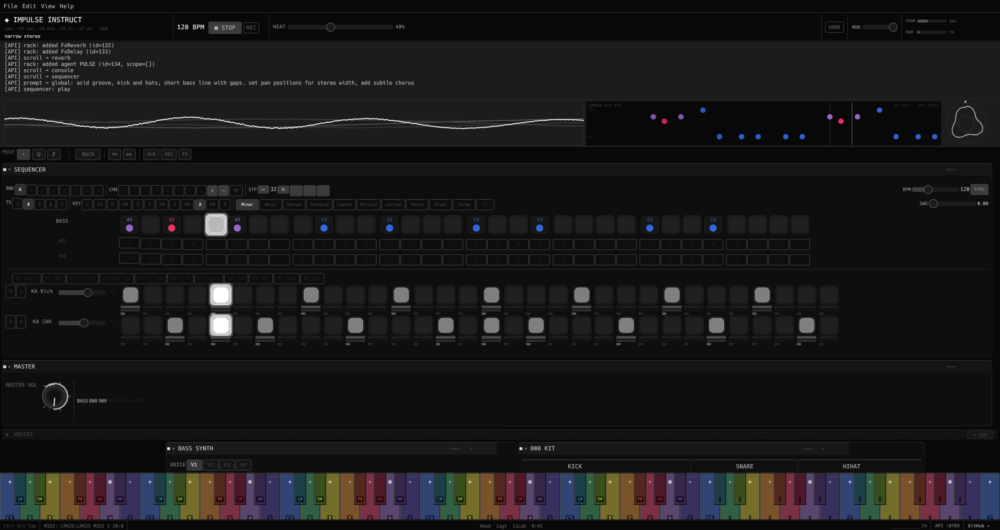
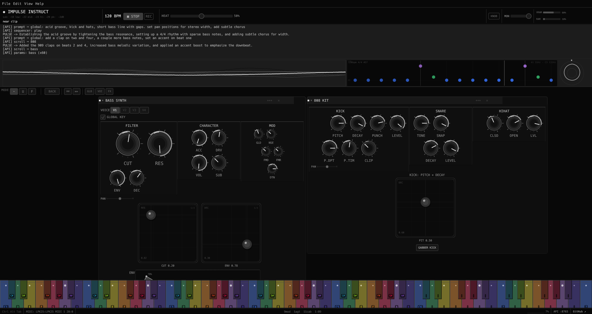
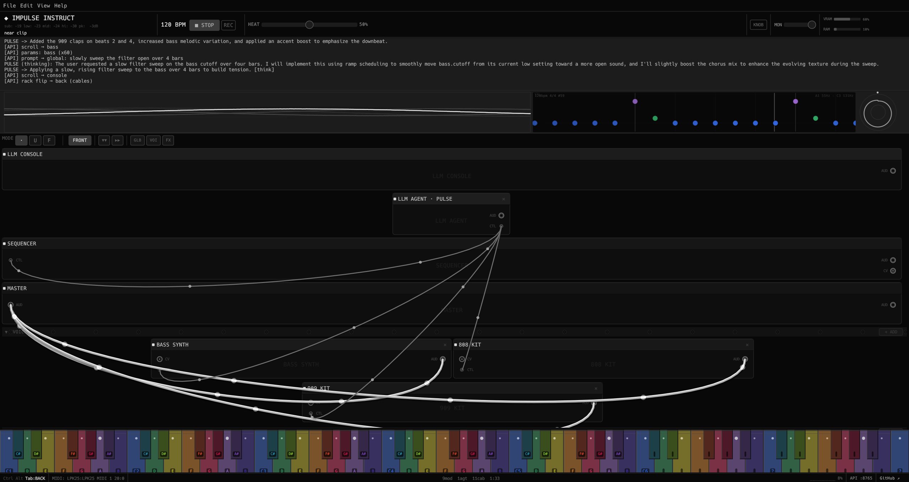

# Impulse Instruct

[](https://github.com/Tok/impulse-instruct/actions/workflows/ci.yml)
[](https://codecov.io/gh/Tok/impulse-instruct)

A **smart synthesizer** with a virtual production team living inside it. Multiple locally-running language models collaborate as AI agents — each with its own persona, scope, and model — to write patterns, shape sound, and evolve a track in real time. One agent handles bass, another drums, a third sculpts FX, and a conductor coordinates the session. Or run a single agent that controls everything. You decide the lineup.

<p align="center">
  
</p>

You talk to them the way you'd talk to collaborators in the studio. Say "make it acid" and the bass agent adjusts the ladder filter, env mod, resonance, and note density. Say "dark techno, sparse, 132 BPM" and the agents restructure patterns and tighten FX routing to match. Say "keep the kick but change everything else" and the lock system protects what you've dialled in.

The agents run a continuous jam loop, evolving the sound between prompts at a rate you control with the **HEAT** slider. At low heat they nudge filters and rhythm details. At full heat they rewrite patterns, swap instruments, and restructure the FX chain constantly. Agents take turns in round-robin, each bringing its own creative perspective.

Everything runs entirely offline: no cloud calls, no subscriptions, no latency. Multiple LLM instances run locally via llama-server (one per model, ref-counted and shared across agents), the audio engine runs in a dedicated real-time thread, and they communicate through lock-free ring buffers. Nothing leaves your machine.

> **Requires an NVIDIA GPU (CUDA).** A model must be downloaded before first run - see [Getting started](#getting-started).

---

<p align="center">
  
</p>
<p align="center">
  
</p>
<p align="center">
  
</p>

---

## v0.7.1 - Pre-release

**This is pre-release software.** It works and makes sound, but expect rough edges. The UI is functional but visually unpolished in places.

- **Not ready for hyped live crowds.** The agents are agentic - they make their own creative decisions. That's delightful in the studio and potentially awkward in front of 300 people.
- **Full heat means full rewrite.** The same prompt at the same heat will produce different results each run. That's the point.
- **The synthesis is more limited than the LLM's vocabulary.** The gap between what agents intend and what the synth engine produces is where most of the roughness lives.
- **Windows build is untested.** The cross-compile produces a binary but it hasn't been run on real hardware. Linux is the only verified platform.

See [Known Limitations](#known-limitations) for specifics.

---

## Download

Pre-built binaries are available on the [releases page](https://github.com/Tok/impulse-instruct/releases):

- `impulse-instruct-linux-x86_64` - Linux (Ubuntu 22.04+) - primary development platform, tested
- `impulse-instruct-windows-x86_64.exe` - Windows 10/11 - cross-compiled, **untested**

**No installation required.** Download, make executable (Linux: `chmod +x`), and run.

---

## Getting started

### 1 - Download a model

The app ships without a model. Download one before first run:

```bash
./scripts/download-models.sh          # Gemma 4 E4B (~4.6 GB, recommended)
./scripts/download-models.sh bonsai   # Bonsai 8B (~1.1 GB, lightweight fallback)
```

A free [HuggingFace](https://huggingface.co/join) account is required. The script handles authentication and places the file in `models/`.

On **Windows**, run the equivalent `.bat` script:
```
scripts\download-models.bat
scripts\download-models.bat bonsai
```

### 2 - Run

```bash
./impulse-instruct-linux-x86_64
```

The app auto-detects the model in `models/` and connects to it. The startup wizard detects your GPU, shows available VRAM, and suggests a configuration. Click a preset or press Enter to start.

---

## Models

| Model | Size | VRAM | Notes |
|-------|------|------|-------|
| **Gemma 4 E4B Q4_K_M** | ~4.6 GB | ~6 GB | **Recommended.** Best JSON accuracy, passes all integration tests. |
| **Bonsai 8B Q1_0_g128** | ~1.1 GB | ~2 GB | Lightweight agent. Fits in 2 GB VRAM. Great for specialist agents in a multi-model team. |
| **DeepSeek-R1-Distill-Qwen-7B** | ~5 GB | ~7 GB | Chain-of-thought capable, Qwen2.5 base. |
| **DeepSeek-R1-Distill-Qwen-14B** | ~9 GB | ~11 GB | Higher quality CoT, needs 12+ GB VRAM. |

Each agent can run a different model. A `LlamaServerPool` manages server processes — agents sharing the same model share a single server (ref-counted). Typical multi-agent VRAM budgets:

| Setup | Agents | VRAM |
|-------|--------|------|
| **Solo** | 1x Gemma | ~6 GB |
| **Duo** | 2x Gemma (shared server) | ~6 GB |
| **Band** | 1x Gemma conductor + 4x Bonsai players | ~8 GB |
| **Swarm** | 1x Gemma + 3x Bonsai | ~8 GB |
| **Lite** | 1x Bonsai | ~2 GB |

---

## What's new in v0.7.1

**32-step sequencer default** — patterns now default to 32 steps (two bars) with support for per-voice lengths and polyrhythm. LLM agents are aware of step counts and spread patterns across the full range.

**Per-voice stereo pan** — every voice (bass, drums, hoover, AN1X, noise) has a pan knob. Agents actively set pan positions for stereo width.

**Auto-highlight on LLM response** — when an agent modifies a module, that module gets a brief highlight animation so you can see what changed.

**API params push to audio** — parameter changes via the HTTP API (`POST /api/params`) now immediately affect the audio output. Filter sweeps, pad movements, and all param changes from the API are audible in real time.

**Demo recording system** — 10+ demo scenarios with NeuTTS Air narration, automated rack setup, filter sweeps, multi-agent jams. Captures video (GPU-accelerated h264_nvenc), isolated app audio via PipeWire.

**TTS as rack module** — NeuTTS Air voice cloning with per-module settings (voice reference, temperature, top-k), wired via control cables from agents.

**Real-time mix observer** — audio analysis (sub/low/mid/hi band levels, peak, stereo correlation) runs every ~2s and is injected into every LLM prompt. Agents self-correct based on mix state.

**Wizard improvements** — click a preset to directly apply it (no separate submit button). Enter submits, arrow keys navigate. Session restore respects clean starts.

**474 unit tests** — +37 since v0.7.0. All passing.

See [docs/features.md](docs/features.md) for the full feature list.

---

## Features

**Synthesis**
- TB-303-style bass synth - saw/square/supersaw with detuned unison, 4-pole Moog ladder filter (LP/HP/BP), sub-oscillator, FM pair, waveshaper, overdrive, per-step accent and slide
- 808-style drum machine - kick with pitch envelope, snare, two hihats, toms
- 909-style drum machine - kick, snare, two hihats, clap, rim
- AN1X-style virtual analog voice - dual oscillator, hard sync, ring mod, two independent ADSRs, two per-voice LFOs, pitch envelope, free EG (8-step drawable envelope)
- Hoover lead synth - supersaw into aggressive highpass sweep
- Standalone noise voice - white/pink/brown with AR envelope, filter LFO, sample-and-hold modulation
- Granular texture voice - overlapping micro-grains from loaded WAV with density, size, position jitter, pitch scatter
- Amen break sampler voice - loop-playback with pitch control

**Sequencer**
- 1 to 64 steps per pattern (default 32), independently configurable per voice (polyrhythm)
- Per-step velocity, probability, ratchet (1-4x), accent, slide
- Euclidean rhythm generator; swing; time signature selector (4/4, 3/4, 5/4, 6/8, 7/8, ...)
- Pattern bank (8 slots); chain playback (up to 8 patterns in sequence)
- Live record from MIDI keyboard; mute/solo per voice; copy/paste

**FX and modulation**
- Reverb, delay (echo), chorus/ensemble, 4-stage phaser, ring modulator
- Waveshaper (pre-FX tanh saturation), bitcrush (bit depth + rate), 3-band EQ, tape saturation, master drive
- Master compressor/limiter; multiband mode (3-band crossover); sidechain compression (kick ducks bass/pad)
- Tape delay with wow/flutter modulation and feedback saturation; reverb freeze (infinite hold)
- Stereo width control (mid/side decorrelation); cross-modulation (bass-AN1X pitch FM, noise-filter)
- Modular rack: drag-to-patch cable connections between voices and FX modules; animated Bezier cables with signal flow dots
- 4-slot LFO matrix - any waveform, BPM-syncable, wireable to any parameter

**Intelligence - multi-agent production team**
- Multiple LLM agents, each with its own persona, model, scope, heat, temperature, and style
- Agents take turns in round-robin; each agent only controls the modules it's wired to via control cables
- Server pool: `LlamaServerPool` manages N llama-server processes, ref-counted per model
- Startup wizard: detects GPU VRAM, click-to-apply presets (Solo, Duo, Band, Swarm, Lite)
- Dynamic spawning: agents can request new agents or dismiss themselves via JSON actions
- Cable-driven scope: control cables from agent to module define what each agent can touch
- Jam mode: continuous autonomous loop, rate and intensity controlled by HEAT slider (0-100%)
- Lock system: touch any knob to claim it; agents will not overwrite user-owned parameters
- Scale and root note in system prompt; bass notes snapped to current scale
- Parameter ramps: agents can set target value + duration for gradual changes over bars
- Auto-highlight: modules flash when an agent modifies them
- 29 genre styles with keywords, BPM ranges, seed patterns, MC lines, and themes
- LISTEN button: captures audio, runs per-band analysis, prepends snapshot to prompt
- Agent memory and style learning across sessions

**TTS / MC mode**
- NeuTTS Air voice cloning (local GGUF, ~527MB model)
- Per-module settings: voice reference, temperature, top-k, pitch snap
- Wired via rack control cables from agents

**I/O and integration**
- MIDI in: NoteOn/Off to bass synth and live record; CC to synth params; Start/Stop transport
- MIDI clock out: 24 PPQN via dedicated thread (alloc-free audio path)
- HTTP/MCP REST API on port 8765 - query state, send prompts, set params, lock/unlock, control transport, rack management
- OSC input: UDP listener, compatible with Max/MSP, TouchOSC, Ableton
- WAV export (32-bit float) and MP3 export (via ffmpeg); stem export per voice
- Project save/load as JSON snapshots; undo/redo (50-deep history)

---

## Talking to the agents

Prompts typed in the LLM console go to the first active agent. Each agent reads the full parameter schema, understands music terminology and genre vocabulary, and writes back structured JSON applied to the synth in real time. In multi-agent setups, each agent only controls the modules it's wired to.

### Agents are collaborators, not knobs

Agents don't execute instructions like a script - they interpret them. "Make it more acidic" at heat 60% will produce a different result every time, informed by the conversation so far, the current state of the synth, and whatever the model considers musically coherent in that context.

**What to expect:**
- High creativity, especially on style and genre prompts
- Occasional wild interpretations of ambiguous requests
- Cumulative drift over long jam sessions as the context fills up
- Agents may change something you didn't ask them to change
- In multi-agent setups, agents evolve their scoped instruments independently

**What not to expect:**
- Exact repeatability - this is a generative system
- Perfect parameter targeting every time
- Reliable MC performance in live settings

To constrain behaviour: drag heat down, lock the parameters you care about, or be more specific in your prompts.

### Heat - the jam intensity dial

The **HEAT** slider in the header controls how aggressively agents mutate the sound on their own.

| Heat | What happens |
|------|-------------|
| **0%** | Parked. Jam loop stops. Only responds to explicit prompts. |
| **~15-25%** | Subtle drift - nudges filters, levels, and rhythm details. Good for long sets. |
| **~30-40%** | Default sweet spot. Slow pattern evolution, filter sweeps, occasional step changes. |
| **~60-75%** | Active rearrangement - new patterns, instrument swaps, FX edits every few bars. |
| **100%** | Full chaos. Rewrites everything constantly. |

### The lock system

Touch any knob or slider and a small **U** indicator appears - that parameter is now **user-owned**. Agents see it as locked and will not overwrite it, even at full heat.

- **dot** - Free - agents can touch this
- **U** - User-owned - yours; agents skip it
- **F** - LLM focus - agents prioritise this parameter

---

## Prompt examples

### Vibe and style

```
make it acid
dark techno, slow and hypnotic
go full jungle - fast breaks, heavy sub
BoC vibes - detuned, warm, melancholic
early 90s rave, hoover lead up front
go minimal - strip everything back
```

### Rhythm and sequencer

```
sparse kick pattern, leave space
four-on-the-floor with an offbeat hihat
euclidean 5/16 on the kick
syncopate the bass, drop the root on beat 1
swing everything harder
```

### Sound design

```
more resonance, less decay on the filter
open up the cutoff slowly
make the bass supersaw with lots of unison
add FM to the bass - subtle, just for texture
```

### FX and routing

```
wire up the reverb on the snare
add a short delay to the hihat - dotted eighth
add tape saturation to the master
add an LFO on the filter cutoff - slow sine, 0.5 depth
```

### Production moves

```
raise the BPM to 140
transpose everything up a fifth
change the scale to Dorian
lock the BPM - don't touch it
slowly sweep the filter open over 4 bars
```

---

## Known Limitations

The LLM understands musical intent well. When a style doesn't land, the cause is usually the synth not being able to fully deliver it, or the system prompt not guiding agents specifically enough.

**What works well:** acid bass. The ladder filter, env mod, resonance, and slide are all solid.

**What doesn't yet:** the hoover lead exists but doesn't sound like a hoover. The Amen break is synthesised step-by-step rather than sampled. Some genre textures are partially wired but not finished.

**What's improved in v0.7.1:** ambient and drone have dedicated tools (long envelopes, granular texture, reverb freeze, cross-modulation). The 32-step default gives patterns more room to breathe. Real-time mix analysis helps agents self-correct. API parameter changes are now audible.

---

## Test Suites

474 unit tests plus 3 LLM integration suites that run against a real model:

| Suite | What it tests |
|-------|--------------|
| [`llm_suite`](src/llm_suite.rs) | Core parameter targeting |
| [`llm_suite_style`](src/llm_suite_style.rs) | Genre and artist references |
| [`llm_suite_theory`](src/llm_suite_theory.rs) | Producer terminology and music theory |

```bash
./scripts/run-llm-tests.sh      # all suites (needs a running model + GPU)
```

All passing on Gemma 4 E4B Q4_K_M.

**Contributions welcome** - see [CONTRIBUTING.md](CONTRIBUTING.md).

---

## Farbige Noten - Color Theory

The piano display uses Ch. A. B. Huth's *Farbige Noten* (Hamburg 1888-1889), a 12-color system mapping each chromatic semitone to a hue on the RYB wheel. Full details in [docs/colorful-notes.md](docs/colorful-notes.md).

---

## Tech stack

Written in Rust. Key dependencies:

| Component | Library |
|-----------|---------|
| UI | [egui](https://github.com/emilk/egui) / eframe 0.28 |
| Audio I/O | [cpal](https://github.com/RustAudio/cpal) 0.15 |
| Audio thread - DSP | [rtrb](https://github.com/mgeier/rtrb) lock-free ring buffer |
| LLM inference | [llama-server](https://github.com/ggml-org/llama.cpp) (official) / [PrismML fork](https://github.com/prism-ml/llama.cpp) for Bonsai 1-bit |
| TTS voice cloning | [NeuTTS Air](https://huggingface.co/neuphonic/neutts-air) (GGUF, local) + [espeak-ng](https://github.com/espeak-ng/espeak-ng) (phonemization) |
| HTTP/MCP API | [axum](https://github.com/tokio-rs/axum) 0.7 |
| MIDI | [midir](https://github.com/Boddlnagg/midir) 0.9 |

---

## License

MIT - see [LICENSE](LICENSE)

Gemma 4 model: [Google Gemma Terms of Use](https://ai.google.dev/gemma/terms)
Bonsai 8B model: Apache 2.0 - credit to [prism-ml](https://huggingface.co/prism-ml)

---

## Further reading

| | |
|---|---|
| [docs/multi-agent.md](docs/multi-agent.md) | Multi-agent jamming: setup, presets, control cables, round-robin scheduling |
| [docs/dev-setup.md](docs/dev-setup.md) | Build from source, architecture, HTTP API reference, Windows cross-compile |
| [docs/features.md](docs/features.md) | Detailed list of all implemented features |
| [CONTRIBUTING.md](CONTRIBUTING.md) | How to contribute styles, tests, model benchmarks, and voice tuning |
| [docs/colorful-notes.md](docs/colorful-notes.md) | Huth *Farbige Noten* color theory |
| [docs/ui-design.md](docs/ui-design.md) | UI design principles, grayscale palette, widget system |
